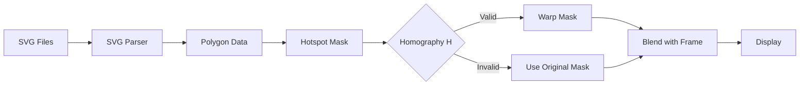

# Hotspot Overlay Design

## Architecture

### Hotspot Loader Module

新增 `hotspot_loader.py` 模块，负责：

1. 扫描 `assets/hotspot/*.svg` 文件
2. 解析 SVG 中的 `<path>` 元素
3. 提取 `d` 属性中的坐标数据
4. 转换为 OpenCV 多边形格式 (numpy array)

### SVG 解析策略

SVG 文件结构：

```xml
<svg width="2240" height="1344" viewBox="0 0 2240 1344">
  <path d="M255.44 350.99C252.66..." fill="black"/>
</svg>
```

使用 `svgpathtools` 或手动解析 SVG path `d` 属性：

- `M` = moveto
- `L` = lineto
- `C` = curveto (贝塞尔曲线，需采样成折线)
- `Z` = closepath

### Rendering Pipeline

```
1. Load SVG hotspots → Dict[name, List[polygon]]
2. Create hotspot mask (2240x1344, BGRA)
3. For each hotspot:
   - cv2.fillPoly(mask, polygon, (0, 255, 0, 128))
4. Resize mask to display resolution (640x480)
5. Blend with reference frame: ref_with_hotspots = cv2.addWeighted(ref, 1, mask_rgb, 0.5, 0)
```

### Real-time Transformation

当 Homography `H` 有效时：

```python
# Transform hotspot mask using inverse homography
warped_mask = cv2.warpPerspective(hotspot_mask, H, (width, height))
# Overlay on current frame
cv2.addWeighted(current_frame, 1, warped_mask, 0.5, 0)
```

## Data Flow



## Dependencies

需要添加的 Python 库：

- `svgpathtools`: SVG path 解析
- 或使用 `xml.etree.ElementTree` + 自定义 path 解析器

## Performance Considerations

1. **预计算热区遮罩**：启动时加载所有 SVG 并创建合并的遮罩图像
2. **避免每帧重新解析**：热区数据在初始化时缓存
3. **使用 OpenCV 硬件加速**：`cv2.warpPerspective` 支持 GPU 加速
