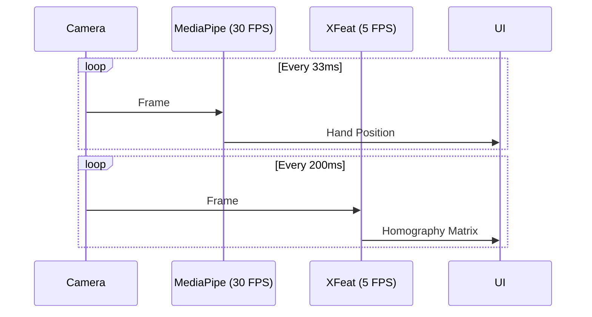
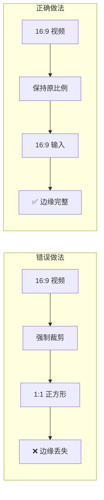
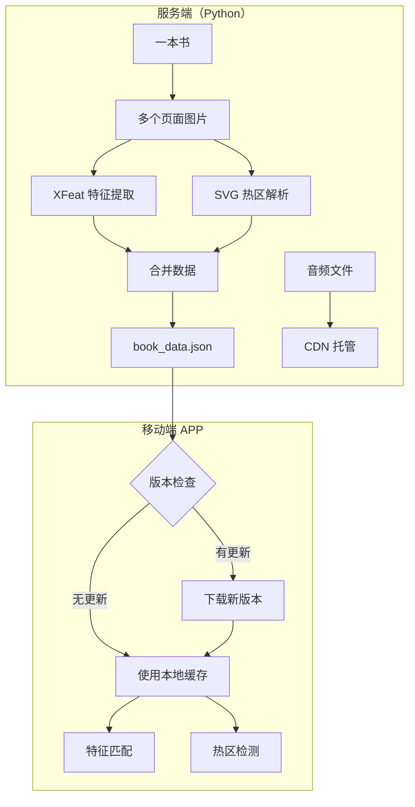
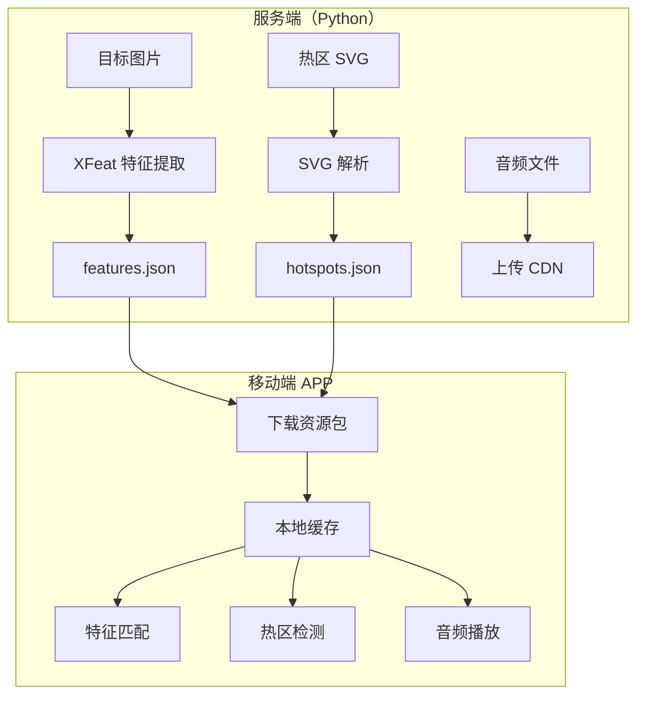

# Design: Mobile Port Architecture

## Context

XFeat 是一个基于 PyTorch 的轻量级特征检测/匹配库，当前仅支持桌面端运行。目标是将其核心功能移植到 iPadOS、iPhone 和 Android 平台，用于 AR 绘本阅读等教育应用场景。

### 当前技术栈

| 组件 | 桌面端实现 | 备注 |
|------|-----------|------|
| 特征提取 | PyTorch (`modules/model.py`) | 6MB 模型 |
| 推理接口 | `modules/xfeat.py` | 稀疏/稠密匹配 |
| 手势追踪 | MediaPipe Python | `hand_landmarker.task` |
| 热点加载 | `svgpathtools` | SVG → 多边形 |
| 音频播放 | pygame/sounddevice | MP3 播放 |
| 可视化 | OpenCV | 实时渲染 |

### 约束条件

- 模型大小限制：App Store 下载大小敏感
- 电池消耗：长时间使用不应过热
- 隐私合规：需要相机权限说明
- **外接 UVC 摄像头**：iPad/Android 使用外接摄像头（当前无硬件可测试）

---

## Goals / Non-Goals

### Goals

- ✅ 在 iPadOS 上实现完整的图像追踪 + 手势检测 + 音频播放流程
- ✅ 在 iPhone 上支持内置摄像头
- ✅ 在 Android 上实现同等功能
- ✅ MediaPipe 实现 30 FPS 手势追踪
- ✅ XFeat 实现 5 FPS 图像追踪（足够维持 Homography）
- ✅ 支持横屏/竖屏模式切换
- ✅ 服务端预计算特征点，APP 下载使用

### Non-Goals

- ❌ 不移植训练功能
- ❌ 不实现模型微调/在线学习
- ❌ 暂不支持多图追踪
- ❌ 暂不优化为生产级应用（保持 POC 定位）

---

## Key Decisions

### Decision 1: 帧率分离策略

**选择**：MediaPipe 30 FPS + XFeat 5 FPS



**理由**：

- 手势追踪需要高帧率保证流畅交互体验
- 图像追踪只需维护 Homography 矩阵稳定性，5 FPS 足够
- 两者交错执行，避免 CPU/GPU 峰值

### Decision 2: 视频流宽高比处理

**选择**：保持原始宽高比，不强制转换为正方形

> [!CAUTION]
> **关键约束**：MediaPipe 和 XFeat 都支持任意宽高比（16:9、4:3 等）的视频输入。
> **绝对禁止**强制裁剪或填充为正方形，这会导致书页边缘区域丢失，热区无法点击！



**横屏/竖屏处理**：

| 场景 | 摄像头物理输出 | 逻辑显示尺寸 | 处理方式 |
|------|---------------|-------------|---------|
| 横屏 (Landscape) | 1920x1080 | 1920x1080 | 直接使用 |
| 竖屏 (Portrait) | 1920x1080 | 1080x1920 | 旋转变换 |

```swift
// iOS 坐标变换示例
func transformForOrientation(_ point: CGPoint, 
                              cameraSize: CGSize,
                              orientation: UIDeviceOrientation) -> CGPoint {
    switch orientation {
    case .portrait:
        // 摄像头输出需要旋转 90°
        return CGPoint(x: point.y, y: cameraSize.width - point.x)
    case .landscapeLeft, .landscapeRight:
        return point  // 直接使用
    default:
        return point
    }
}
```

**理由**：

- 书页边缘的热区必须可达
- MediaPipe 内部自动处理不同宽高比，无需手动干预
- 坐标变换在显示层处理，不修改原始数据

### Decision 3: 服务端预计算架构

**选择**：特征提取在服务端完成，APP 只做匹配

> [!IMPORTANT]
> **多页书籍统一数据格式**：一本书的所有页面（封面、内页）的特征点和热区数据合并为单一 JSON 文件，便于一次性下载和版本管理。



**书籍数据 JSON 格式 (book_data.json)**:

```json
{
  "version": "1.0.0",
  "bookId": "my-first-word-book",
  "updatedAt": "2024-01-15T10:30:00Z",
  "pages": [
    {
      "pageId": "cover",
      "imageSize": [2240, 1344],
      "features": {
        "keypoints": [[x1, y1], [x2, y2], ...],
        "descriptors": [[64 floats], ...],
        "scores": [0.95, 0.93, ...]
      },
      "hotspots": [
        {
          "name": "title",
          "polygon": [[100, 200], [300, 200], [300, 400], [100, 400]],
          "audioUrl": "https://cdn.../title.mp3"
        }
      ]
    },
    {
      "pageId": "page-1",
      "imageSize": [2240, 1344],
      "features": { ... },
      "hotspots": [ ... ]
    }
  ],
  "audioBaseUrl": "https://cdn.example.com/books/my-first-word-book/audio/"
}
```

**版本更新策略**：

- APP 启动时检查 `updatedAt` 时间戳
- 若服务器版本更新，下载新 JSON 覆盖本地缓存
- 音频文件按需下载或预下载

**理由**：

- 单一 JSON 减少网络请求次数
- 便于版本控制和缓存管理
- 离线模式下完全可用



**理由**：

- 大幅降低移动端计算负担
- 无需转换完整 XFeat 模型，只需匹配模块
- 启动速度更快
- 便于更新内容（只需重新生成 JSON）

### Decision 4: 摄像头抽象层

**选择**：统一摄像头接口，支持多种输入源

```swift
// iOS Interface
protocol CameraSource {
    var isAvailable: Bool { get }
    var resolution: CGSize { get }
    func start() async throws
    func stop()
    var framePublisher: AnyPublisher<CVPixelBuffer, Never> { get }
}

class BuiltInCamera: CameraSource { ... }     // iPhone/iPad 内置
class UVCCamera: CameraSource { ... }         // iPad/Android 外接
```

**理由**：

- iPad 使用外接 UVC 摄像头，iPhone 使用内置摄像头
- 开发阶段可先用内置摄像头，后续无缝切换
- 便于测试和调试

### Decision 5: 平台原生开发

**选择**：Swift (iOS) + Kotlin (Android)

| 平台 | 语言 | UI 框架 | 优势 |
|------|-----|---------|------|
| iPadOS/iPhone | Swift | SwiftUI | 最优相机性能、UVC 原生支持 |
| Android | Kotlin | Jetpack Compose | 最佳 TFLite 集成 |

**替代方案（已排除）**：

- Flutter：Dart FFI 层增加复杂度，UVC 支持不完善
- React Native：与 ML 框架集成困难

---

## Module Specifications

### 1. Feature Matcher (移动端)

仅负责特征匹配，不做特征提取。

```swift
// iOS Interface
class FeatureMatcher {
    init(featuresData: Data) throws  // 从 JSON 加载预计算特征
    
    func match(frameDescriptors: [[Float]], topK: Int) -> [Match]
    func computeHomography(matches: [Match]) -> simd_float3x3?
}
```

```kotlin
// Android Interface
class FeatureMatcher(featuresJson: String) {
    fun match(frameDescriptors: Array<FloatArray>, topK: Int): List<Match>
    fun computeHomography(matches: List<Match>): FloatArray? // 3x3
}
```

### 2. Hand Tracker Wrapper

使用 MediaPipe 官方 SDK @ 30 FPS：

```swift
// iOS - MediaPipe Tasks
class HandTrackerWrapper {
    private let handLandmarker: HandLandmarker
    
    func getIndexFingerTip(frame: CVPixelBuffer) -> CGPoint?
    func transformToReference(point: CGPoint, homography: simd_float3x3) -> CGPoint?
}
```

### 3. Hotspot Manager

从 JSON 加载热区数据：

```swift
class HotspotManager {
    init(hotspotsJson: Data) throws
    
    func getZones() -> [HotspotZone]
    func pointInZone(point: CGPoint) -> HotspotZone?
}

struct HotspotZone {
    let name: String
    let polygon: [CGPoint]
    let audioUrl: URL
}
```

### 4. Camera Manager

支持内置和 UVC 摄像头切换：

```swift
class CameraManager {
    enum Source { case builtIn, uvc }
    
    var currentSource: Source
    var framePublisher: AnyPublisher<CVPixelBuffer, Never>
    
    func switchSource(to: Source) async throws
    func listAvailableSources() -> [Source]
}
```

---

## Performance Budget

| 操作 | 目标时间 | 帧率 | 备注 |
|------|---------|------|------|
| MediaPipe 手势 | ≤33ms | 30 FPS | 最高优先级 |
| XFeat 匹配 | ≤200ms | 5 FPS | 仅匹配，无提取 |
| Homography 计算 | ≤10ms | - | RANSAC |
| 热点碰撞检测 | ≤1ms | - | 多边形测试 |

---

## Risks / Trade-offs

### 风险矩阵

| 风险 | 可能性 | 影响 | 缓解策略 |
|------|-------|------|---------|
| 模型转换失败 | 低 | 中 | 只转换匹配模块 |
| UVC 兼容性问题 | 中 | 中 | 先用内置摄像头 |
| MediaPipe 版本差异 | 低 | 低 | 锁定特定版本 |
| 设备碎片化(Android) | 中 | 低 | 定义最低要求 |

---

## Device Requirements

### iOS / iPadOS

| 要求 | 最低版本 | 备注 |
|------|---------|------|
| iOS 版本 | iOS 16+ | UVC 支持需要 iPadOS 17+ |
| 芯片 | A14+ (iPhone 12+) | 2020 年后设备 |
| iPad | iPad (9th gen+), iPad Air (4th gen+), iPad Pro (M1+) | 2021 年后 |

### Android

| 要求 | 最低版本 | 备注 |
|------|---------|------|
| API Level | 28 (Android 9) | |
| OpenGL ES | 3.1 | GPU 加速 |
| USB Host | 必须支持 | UVC 摄像头 |

---

## Migration Plan

### Phase 0: 服务端工具（1-2 天）

1. 创建 `scripts/export_features.py` - 导出特征点到 JSON
2. 创建 `scripts/convert_svg_hotspots.py` - SVG → JSON
3. 测试数据完整性

### Phase 1: 模型验证（1-2 天）

1. 验证特征匹配模块能否独立运行
2. 如需要，导出匹配模块为 ONNX → Core ML

### Phase 2: iPadOS 原型（1-2 周）

1. 创建 Xcode 项目
2. 集成 MediaPipe 30 FPS 手势追踪
3. 实现特征匹配（先用预计算数据）
4. 集成热点检测 + 音频播放
5. **使用内置摄像头测试**

### Phase 3: iPhone 支持（3-5 天）

1. 适配前置/后置摄像头切换
2. 处理不同 iPhone 屏幕尺寸

### Phase 4: UVC 摄像头（待硬件）

1. 集成 iPadOS External Camera API
2. 处理热插拔
3. 兼容性测试

### Phase 5: Android 移植（1-2 周）

1. 创建 Android Studio 项目
2. 移植所有功能模块
3. 集成 UVC 摄像头（可能需要 UVC Camera 库）

### Phase 6: 测试优化（1 周）

1. 多设备兼容性测试
2. 性能调优
3. UVC 摄像头品牌兼容性测试

---

## Open Questions

1. **推荐的 UVC 摄像头品牌/型号？**
   - 需要：USB-C 接口、1080p、低延迟
   - 建议测试：Logitech、Elgato、Magewell

2. **书籍资源如何更新？**
   - 当前设计：APP 启动时检查更新
   - 后续可考虑：后台下载、增量更新

3. **离线模式？**
   - 当前设计：资源下载后完全离线可用
   - 音频文件需要预下载
