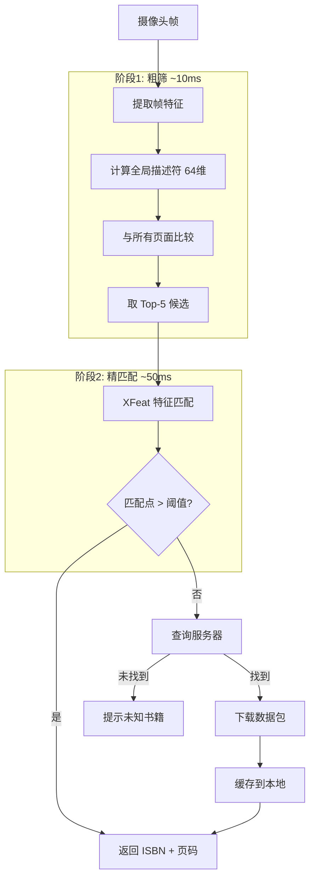

# Change: Port XFeat Demo to Mobile Platforms (iPadOS, iPhone & Android)

## Why

当前 XFeat 实时演示应用仅能在桌面端（Python + PyTorch）运行。为了扩展其应用场景到移动设备（如教育类 AR 绘本阅读应用），需要将核心功能移植到 iPadOS、iPhone 和 Android 平台。

## What Changes

### 核心功能移植

- **书籍识别**：通过任意页面的特征自动识别书籍 ISBN，支持本地缓存和服务器查询
- **XFeat 特征匹配**：APP 端仅做特征匹配，特征提取在服务端预计算
- **手势追踪**：使用 MediaPipe 原生 SDK（默认 30 FPS，可配置）
- **图像追踪**：XFeat 匹配（默认 5 FPS，可配置）
- **热点检测**：从服务端下载 JSON 格式热区数据（服务端编辑器直接输出，无需 SVG 转换）
- **音频播放**：音频文件随数据包预下载到本地

### 平台特定实现

- **iPadOS/iPhone**：Swift/SwiftUI + Core ML + AVFoundation + MediaPipe iOS SDK
- **Android**：Kotlin + TensorFlow Lite + MediaPlayer + MediaPipe Android SDK

### 视频输入

- **iPad/Android**：外接 UVC 摄像头（USB-C 接口）
- **iPhone**：内置摄像头（前置/后置）

### UI 设计

- **极简界面**：仅保留视频窗口 + 热区覆盖显示
- **热区覆盖**：可在设置中开关
- **设置页面**：帧率配置、摄像头切换、热区显示开关

## Impact

### Affected Specs

- 新增 `mobile-platform` 能力规范

### Affected Code

- 无需修改现有 Python 代码
- 创建全新的移动端项目
- 服务端编辑器（另一个项目）直接输出 JSON 格式

---

## 已确认的技术决策

| 决策项 | 选择 | 备注 |
|--------|-----|------|
| 开发方式 | 原生开发 | Swift (iOS) + Kotlin (Android) |
| 开发优先级 | iPadOS 优先 | 然后 iPhone，最后 Android |
| iPhone 支持 | ✅ 是 | 使用内置摄像头 |
| 设备范围 | 近3年型号 | 2022年后上市的设备 |
| MediaPipe 帧率 | 30 FPS（默认） | 可在设置中配置 |
| XFeat 帧率 | 5 FPS（默认） | 可在设置中配置 |
| 书籍标识 | ISBN | 国际标准书号作为唯一 ID |
| 热区数据 | 服务端直接输出 JSON | 无需 SVG 中间格式 |
| 音频文件 | 预下载到本地 | 随数据包一起缓存 |
| 宽高比 | 保持原始比例 | 禁止强制转正方形 |

---

## 书籍识别方案

> [!IMPORTANT]
> **核心挑战**：当用户翻开任意一本书的任意页面，系统需要自动识别是哪本书（ISBN）和哪一页。

### 推荐方案：分层检索（粗到细）



### 识别状态机

| 状态 | 匹配范围 | 延迟 | 说明 |
|------|---------|------|------|
| 锁定追踪 | 当前页 | ~30ms | 已识别，持续追踪 |
| 同书翻页 | 同一本书的所有页 | ~50ms | 检测到翻页 |
| 首次识别 | 本地所有书 | ~100ms | 新书进入画面 |
| 服务器查询 | 服务器 | ~300ms+ | 本地无匹配 |

### 数据包格式

```json
{
  "isbn": "978-0-xxx-xxxxx-x",
  "version": "1.0.0",
  "updatedAt": "2024-01-15T10:30:00Z",
  "pages": [
    {
      "pageId": "page-1",
      "globalDescriptor": [64 floats],
      "features": {
        "keypoints": [[x, y], ...],
        "descriptors": [[64 floats], ...],
        "scores": [...]
      },
      "hotspots": [
        {
          "name": "apple",
          "polygon": [[x, y], ...],
          "audioFile": "apple.mp3"
        }
      ]
    }
  ],
  "audioFiles": ["apple.mp3", "dog.mp3", ...],
  "audioBaseUrl": "https://cdn.../audio/"
}
```

---

## 风险点分析

> [!CAUTION]
>
> ### 1. 书籍识别准确性 - 中风险（新增）
>
> **问题**：相似页面（如不同书的目录页）可能被混淆
>
> **缓解措施**：
>
> - 使用 XFeat 精匹配验证，需要足够多的匹配点
> - 服务端为每页生成独特的全局描述符
> - 连续多帧确认后才切换识别结果

> [!CAUTION]
>
> ### 2. 模型转换风险 - 中风险
>
> **问题**：PyTorch 模型转换到 Core ML/TFLite 可能存在算子不兼容
>
> **缓解措施**：由于特征提取在服务端完成，移动端只需运行匹配逻辑（纯矩阵运算）

> [!WARNING]
>
> ### 3. UVC 摄像头兼容性 - 中风险
>
> **问题**：iPad/Android 外接 UVC 摄像头的兼容性问题（当前无硬件）
>
> **缓解措施**：先使用内置摄像头开发，UVC 作为后续迭代

> [!NOTE]
>
> ### 4. 实时性能 - 低风险
>
> **解决方案**：MediaPipe 30 FPS + XFeat 5 FPS 分离策略已验证可行

> [!NOTE]
>
> ### 5. 数据格式 - 无风险
>
> **解决方案**：服务端编辑器直接输出最终 JSON，无需 SVG 转换

---

## 阶段性计划

### Phase 0: 服务端工具（1-2 天）

- 特征点导出脚本（含全局描述符）
- 数据包格式定义和验证

### Phase 1: 模型验证（1-2 天）

- 验证移动端特征匹配精度

### Phase 2: iPadOS 原型（1-2 周）

- 极简 UI 实现（视频窗口 + 热区覆盖）
- 书籍识别状态机
- 手势追踪 + 热点检测
- 设置页面

### Phase 3: iPhone 支持（3-5 天）

- 适配内置摄像头

### Phase 4: UVC 摄像头（待硬件）

- iPad 外接 UVC 摄像头

### Phase 5: Android 移植（1-2 周）

### Phase 6: 测试优化（1 周）
