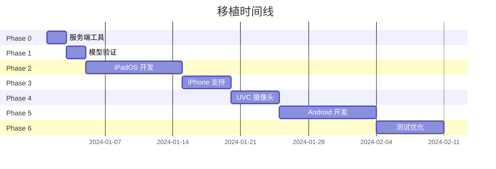

# Tasks: Port to Mobile

## Phase 0: 服务端工具

> [!IMPORTANT]
> 此阶段为前置依赖，提供移动端所需的预计算数据。

### 0.1 特征点导出工具

- [ ] 0.1.1 创建 `scripts/export_features.py`
- [ ] 0.1.2 实现 XFeat 特征提取并导出为 JSON
- [ ] 0.1.3 验证导出的特征点数据完整性
- [ ] 0.1.4 测试导出数据可用于匹配

### 0.2 热区转换工具

- [ ] 0.2.1 创建 `scripts/convert_svg_hotspots.py`
- [ ] 0.2.2 实现 SVG → JSON 转换
- [ ] 0.2.3 验证多边形数据正确性

---

## Phase 1: 模型验证

> [!NOTE]
> 由于特征提取在服务端完成，此阶段验证匹配模块是否可独立运行。

### 1.1 匹配模块分析

- [ ] 1.1.1 分析 `xfeat.py` 中的匹配逻辑
- [ ] 1.1.2 确定哪些函数需要移植到移动端
- [ ] 1.1.3 评估是否需要 ONNX 转换，或可纯代码实现

### 1.2 Core ML 转换（如需要）

- [ ] 1.2.1 导出匹配相关模块为 ONNX
- [ ] 1.2.2 转换为 Core ML
- [ ] 1.2.3 验证精度

---

## Phase 2: iPadOS 实现（优先）

### 2.1 项目设置

- [ ] 2.1.1 创建 Xcode 项目（SwiftUI, iOS 16+）
- [ ] 2.1.2 添加 MediaPipe Tasks Swift Package
- [ ] 2.1.3 配置项目权限（相机、音频）

### 2.2 摄像头模块

- [ ] 2.2.1 创建 `CameraSource` 协议
- [ ] 2.2.2 实现 `BuiltInCamera` 类（AVCaptureSession）
- [ ] 2.2.3 支持横屏/竖屏方向切换
- [ ] 2.2.4 **预留 UVC 摄像头接口**

### 2.3 手势追踪（30 FPS）

- [ ] 2.3.1 集成 MediaPipe `HandLandmarker`
- [ ] 2.3.2 创建 `HandTrackerWrapper` 封装
- [ ] 2.3.3 实现坐标变换（手势坐标 → 参考图坐标）
- [ ] 2.3.4 验证 30 FPS 稳定运行

### 2.4 特征匹配（5 FPS）

- [ ] 2.4.1 实现 JSON 特征数据加载
- [ ] 2.4.2 实现特征匹配算法（MNN matcher）
- [ ] 2.4.3 实现 Homography 计算（RANSAC）
- [ ] 2.4.4 配置 5 FPS 节流

### 2.5 热点系统

- [ ] 2.5.1 实现 JSON 热区数据加载
- [ ] 2.5.2 实现多边形碰撞检测
- [ ] 2.5.3 实现停留检测（Dwell Detection, 300ms）

### 2.6 音频播放

- [ ] 2.6.1 创建 `AudioPlayerManager` 类（AVAudioPlayer）
- [ ] 2.6.2 集成到热点触发逻辑
- [ ] 2.6.3 处理音频中断和恢复

### 2.7 UI 与可视化

- [ ] 2.7.1 实现摄像头预览视图
- [ ] 2.7.2 添加手势指示器叠加层
- [ ] 2.7.3 添加热点区域高亮显示
- [ ] 2.7.4 添加调试信息显示（帧率、匹配点数）

---

## Phase 3: iPhone 支持

### 3.1 摄像头适配

- [ ] 3.1.1 支持前置/后置摄像头切换
- [ ] 3.1.2 处理不同 iPhone 摄像头参数
- [ ] 3.1.3 适配 iPhone 屏幕尺寸

### 3.2 UI 调整

- [ ] 3.2.1 优化 iPhone 竖屏布局
- [ ] 3.2.2 处理刘海屏安全区域

---

## Phase 4: UVC 摄像头支持（待硬件）

> [!WARNING]
> 此阶段依赖外接 UVC 摄像头硬件。

### 4.1 iPad UVC 集成

- [ ] 4.1.1 实现 `UVCCamera` 类
- [ ] 4.1.2 处理 External Camera 权限（iPadOS 17+）
- [ ] 4.1.3 处理热插拔事件
- [ ] 4.1.4 摄像头源切换 UI

### 4.2 兼容性测试

- [ ] 4.2.1 测试推荐的 UVC 摄像头
- [ ] 4.2.2 记录兼容/不兼容设备列表

---

## Phase 5: Android 实现

### 5.1 项目设置

- [ ] 5.1.1 创建 Android Studio 项目（Kotlin, API 28+）
- [ ] 5.1.2 配置 TensorFlow Lite 依赖（如需要）
- [ ] 5.1.3 添加 MediaPipe Tasks 依赖

### 5.2 摄像头模块

- [ ] 5.2.1 实现 CameraX 集成
- [ ] 5.2.2 处理摄像头方向和旋转
- [ ] 5.2.3 预留 UVC 摄像头接口

### 5.3 手势追踪

- [ ] 5.3.1 集成 MediaPipe `HandLandmarker`
- [ ] 5.3.2 创建 `HandTrackerWrapper` 封装
- [ ] 5.3.3 验证 30 FPS

### 5.4 特征匹配

- [ ] 5.4.1 移植特征匹配算法
- [ ] 5.4.2 配置 5 FPS 节流

### 5.5 热点与音频

- [ ] 5.5.1 移植 `HotspotManager`
- [ ] 5.5.2 实现 MediaPlayer 音频播放

### 5.6 UI

- [ ] 5.6.1 实现 Compose 相机预览
- [ ] 5.6.2 添加可视化叠加层

### 5.7 Android UVC

- [ ] 5.7.1 集成 UVC Camera 库（如 UVCCamera）
- [ ] 5.7.2 处理 USB Host 权限
- [ ] 5.7.3 兼容性测试

---

## Phase 6: 测试与优化

### 6.1 功能测试

- [ ] 6.1.1 验证特征匹配精度
- [ ] 6.1.2 验证手势检测准确性
- [ ] 6.1.3 验证热点触发正确性
- [ ] 6.1.4 验证音频播放流程

### 6.2 性能测试

- [ ] 6.2.1 验证 MediaPipe 30 FPS
- [ ] 6.2.2 验证 XFeat 匹配 ≤200ms
- [ ] 6.2.3 检测内存泄漏

### 6.3 兼容性测试

- [ ] 6.3.1 在目标 iPad 型号测试
- [ ] 6.3.2 在目标 iPhone 型号测试
- [ ] 6.3.3 在目标 Android 设备测试
- [ ] 6.3.4 UVC 摄像头品牌兼容性测试

### 6.4 优化

- [ ] 6.4.1 优化热路径代码
- [ ] 6.4.2 添加性能监控指标
- [ ] 6.4.3 优化电池消耗

---

## Dependencies

---

## Verification Criteria

| 模块 | 验证标准 |
|------|---------|
| 特征匹配 | 与桌面端输出一致，匹配率误差 < 5% |
| 手势追踪 | 稳定 30 FPS，食指指尖位置准确 |
| 热点检测 | 正确识别手指进入/离开热点 |
| 停留检测 | 准确触发 300ms 停留事件 |
| 音频播放 | 触发后 < 100ms 开始播放 |
| 整体 | MediaPipe 30 FPS + XFeat 5 FPS 稳定运行 |
